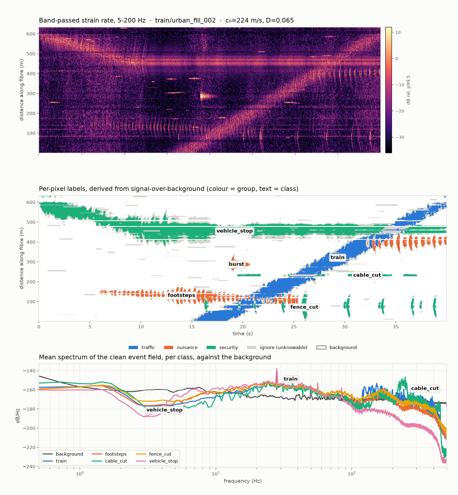

# Nerw

Nerw (Polish for *nerve*) turns an ordinary telecom fibre along a railway into a line of thousands of vibration sensors. The repository has three parts:

- **A simulator.** It generates realistic synthetic **distributed acoustic sensing (DAS)** recordings of trains, people, vehicles and trackside activity.
- **A self-supervised transformer.** It learns what normal fibre data looks like, flags anomalies, and then labels what activity is happening where.
- **A demo dashboard (in Polish).** It shows every scheduled passenger train in Poland on a live map, alongside simulated trackside events.



*A generated 40-second recording. Top: strain rate along 600 m of fibre over time. Middle: the labels the simulator derives from it. Bottom: the spectrum of each activity against the background.*

---

## How DAS works

### The fibre is the sensor

A DAS system needs no sensors along the route. It uses a standard single-mode optical fibre, the same kind already laid beside most railways for signalling and telecoms. One instrument, the **interrogator**, sits at the end of the cable and can monitor tens of kilometres of it.

The interrogator fires short, highly coherent laser pulses (typically at 1550 nm) into the fibre. The glass is not perfectly uniform: tiny density fluctuations frozen in during manufacture scatter a very small fraction of the light back towards the interrogator. This is **Rayleigh backscatter**, and it comes back continuously from every point along the fibre while the pulse travels outward.

```
 interrogator                                         fibre (tens of km)
┌──────────┐  pulse ──────────────────▶
│  laser   │══════════════════════════════════════════════════════════════
│ detector │  ◀─ ─ ─ ─ ─ backscatter from every point along the way
└──────────┘        ↑ z = 100 m        ↑ z = 5 km          ↑ z = 30 km
                 arrives after       arrives after       arrives after
                 ~1 µs               ~49 µs              ~294 µs
```

### Arrival time gives position

Light in glass travels at `c / n`, where the refractive index is n ≈ 1.468. Backscatter that arrives at time `t` after the pulse left came from distance

```
z = c · t / (2 n)
```

The factor of 2 is there because the light went out and back. So **every metre of fibre adds about 9.8 ns of round-trip time**. Sampling the returning light every few nanoseconds gives one reading per metre or so. Each of these points along the fibre is a **channel**.

### Phase gives strain

Because the pulse is coherent, the backscatter from one stretch of fibre interferes with itself into a fixed, speckle-like pattern while the fibre is still. When a passing wave stretches or compresses the fibre, the optical path changes and the **phase** of the backscattered light shifts.

Modern *phase-sensitive* DAS (φ-OTDR) compares the phase at two points a **gauge length** `L` apart. The phase difference is proportional to the average strain `ε` along that stretch:

```
Δφ = (4π · n · ξ · L / λ) · ε
```

Here `ξ ≈ 0.78` corrects for the photo-elastic effect (stretched glass also changes its refractive index). At 1550 nm that is about **9 radians per microstrain per metre of gauge length**. Phase can be resolved to milliradians, so DAS responds to strains of **nanostrain or smaller**, well below what a person would feel.

Most interrogators report the change of this phase between pulses, which is proportional to the **strain rate**. This repository works in that form too: a channel measures the axial strain rate averaged over the gauge,

```
ε̇(x) = ( v(x + L/2) − v(x − L/2) ) / L
```

where `v` is the ground particle velocity along the fibre.

### From pulses to a waterfall

The interrogator repeats this many times a second. A new pulse can only be sent once the previous one has returned from the far end: 40 km of fibre means about 0.4 ms of round trip, so at most about 2.5 kHz. Each pulse produces one row of readings, one value per channel. Stacking the rows gives a **waterfall**: distance along the fibre on one axis, time on the other, and vibration strength as colour, as in the figure above.

A few properties matter for reading that picture:

| Property | What it means |
| --- | --- |
| **Channel spacing** | How far apart readings are along the fibre (here 1.02 m). |
| **Gauge length** | The stretch each reading averages over (here 10 m). Features shorter than the gauge are smeared. A wave whose wavelength equals the gauge length cancels itself out. |
| **Axial sensitivity** | The fibre feels stretching *along* its length. A wave travelling along the cable registers strongly; one arriving broadside barely does. |
| **Coupling** | Fibre in a buried duct hears the ground well. A loose or suspended span (a bridge, a free-hanging section) hears it poorly or picks up its own noise. |
| **Attenuation** | Ground vibration dies away with distance, faster at high frequency. Each source therefore lights up only its own stretch of fibre. In this simulator a 50 Hz source is 20 dB weaker about 66 m away. |

### What activity looks like

Different activities leave distinct shapes in the waterfall. Detection and classification rely on these:

| Activity | Signature in time × distance |
| --- | --- |
| **Train** | A long bright diagonal band. Its slope is the train's speed, and wheel and axle impacts add fine texture. Unmissable. |
| **Wheel flat** | A train band with a regular hammering pattern at the wheel's rotation rate. |
| **Road vehicle** | A fainter diagonal where a road runs close to the line. |
| **Footsteps** | Short, weak impulses at walking cadence that drift slowly along the fibre. Close to the noise floor. |
| **Digging** | Repeated impacts at one fixed position, at irregular intervals. |
| **Cable cut (grinder)** | A stationary tonal band with gritty bursts. |
| **Track tampering** | Hammer blows at one spot. Some energy also travels along the rail itself, so it appears almost instantly far away. |
| **Fence cut** | Sparse, faint snips that creep along a fence line. |
| **Vehicle stopping** | A diagonal that slows and halts, then a stationary band from the idling engine. |
| **Blast / impulsive burst** | A V-shaped fan spreading from a single point at the seismic wave speed. |

### What DAS cannot tell you

DAS resolves **what is being done and where**: digging at 1.3 km, footsteps crossing at 4.7 km. It does **not** resolve who is doing it or why. A maintenance crew and an intruder with a spade produce the same waveform. No amount of training changes that. This repository's classes are named after activities, not intentions.

Real recordings are also full of things that are not events: traffic on nearby roads, wind, rain, temperature drift, mains hum, laser noise, and sections of fibre that are badly coupled or dead.

---

## What is in this repository

| Path | What it does |
| --- | --- |
| [`simulate_das.py`](simulate_das.py) | Generates one synthetic recording (miniDAS-style HDF5): physics, background, labels and output format. |
| [`make_dataset.py`](make_dataset.py) | Draws randomised scenarios over site families and builds a train / validation / test dataset. |
| [`validate_sim.py`](validate_sim.py) | Checks a generated run from its files alone: format, `traces == signal + background`, class contrast, gauge-length spatial signature, apparent event speed. |
| [`model/`](model/) | The transformer: self-supervised pre-training, anomaly scoring, and a stage-2 per-pixel activity classifier. |
| [`make_showcase.py`](make_showcase.py) | Renders the overview figure above from a dataset. |
| [`dashboard/`](dashboard/) | A Polish-language rail monitoring demo with scheduled trains and simulated events. [Live demo](https://nerw-mapa-kolejowa.onrender.com). |
| [`specfem2d/surface_blast/`](specfem2d/surface_blast/) | A standalone full-wavefield (SPECFEM2D) simulation of a surface blast recorded by a buried fibre. |
| [`tests/`](tests/), [`model/tests/`](model/tests/) | Generator, dataset and model tests. |

### The simulator

`simulate_das.py` is a kinematic model: fast enough to build thousands of recordings, while keeping the physics that decides what a detector sees.

- **One propagation operator for every source.** Surface waves are dispersive and attenuating. Stationary sources (digging, a grinder) and moving sources (trains, walkers) go through the same operator, so the way a signal was synthesised never gives its class away. A test checks that the two paths agree for a source that does not move.
- **Physical attenuation.** Soil damping grows linearly with frequency, confining each event to its own stretch of fibre.
- **Multiple paths.** Track tampering adds a fast, almost undamped path along the rail on top of the path through the ground.
- **Gauge length.** Readings are the gauge-length difference described above. Instrument noise passes through the same operator, so noise and signal share a spatial transfer function.
- **A realistic background.** Instrument phase noise, laser common-mode noise, thermal drift, mains hum, microseism and ambient surface waves. It also includes weak and dead channel runs, glitches, and unlabelled transient bursts.
- **Labels from signal strength, not geometry.** A cell gets an activity class only where that event is at least 6 dB above the background. Cells that are ambiguous (3–6 dB, overlapping events, or touched by unlabelled transients) are marked *ignore* and excluded from training and scoring.

Defaults for one recording: **1 kHz sampling, 300 channels at 1.02 m spacing, 10 m gauge length, 40 s**.

### Activity classes

| Group | Classes | Peak SNR used in the dataset |
| --- | --- | --- |
| Traffic | `train`, `wheel_flat`, `road_vehicle` | 26–48, 22–42, 12–32 dB |
| Nuisance | `footsteps`, `burst` | 4–16, 5–20 dB |
| Security activity | `digging`, `cable_cut`, `track_tamper`, `fence_cut`, `vehicle_stop` | 8–24, 6–22, 10–28, 3–13, 12–30 dB |

The ranges differ on purpose. A train on trackside fibre is never hard to find, and the job is to name it. A person walking, or bolt croppers on a fence, sits just above the noise.

### The dataset split

Recordings are generated for six **site families**: different ground stiffness, geometry, background and event mix. The split is by family, not by random seed. `embankment_soft`, `cutting_stiff`, `urban_fill` and `coastal_marsh` feed training and validation; `viaduct_hard` and `peat_quiet` appear **only** in the test set. A model therefore has to generalise to kinds of site it has never seen.

### The model

- **Stage 1: learn what normal looks like.** A LeJEPA-style transformer is pre-trained without labels. It masks spans of time and reconstructs them, with a SIGReg regulariser that keeps the learned representation well spread. An anomaly detector then combines the reconstruction error with how unusual the embedding is. It is calibrated on background-only windows.
- **Stage 2: name the activity.** A per-pixel classification head on the pre-trained backbone labels every channel and time step. A `--scratch` ablation trains the same head without pre-training, to measure what stage 1 contributes.

Every model number should be compared against the band-passed energy baseline that `model.evaluate` prints. On raw, unfiltered windows the model once matched a simple energy detector almost exactly, which is why both stages high-pass the input.

### The rail dashboard

[**nerw-mapa-kolejowa.onrender.com**](https://nerw-mapa-kolejowa.onrender.com) shows every scheduled passenger train in Poland, placed on its track from the published PKP PLK timetable (GTFS by Mikołaj Kuranowski). By default it runs at 60× speed. It also shows a stream of **simulated** trackside events of the kinds DAS would detect, such as a vehicle stuck on a level crossing, an illegal track crossing, digging near the cable or a detonation. For each event it shows which trains are due at that spot and the stations on its line.

Every event on the dashboard is a made-up scenario; none happened. Train positions follow the timetable, not real-time data, so delays are not shown. The page is a single static file; see [`CLAUDE.md`](CLAUDE.md#rail-dashboard) for how its data file is rebuilt.

---

## Getting started

The environment is managed with [uv](https://docs.astral.sh/uv/). PyTorch is installed from the CUDA index configured in `pyproject.toml`, and heavy array work runs on the GPU when one is available.

```bash
uv sync
uv run pytest

# one recording (fixed default scene, or --scenario scene.json)
uv run python simulate_das.py --out data/synthetic/run01
uv run python validate_sim.py data/synthetic/run01/das.h5

# a full dataset (~2.8 s per recording with 8 workers on one GPU)
uv run python make_dataset.py --out data/synthetic/v4 \
    --train-runs 300 --val-runs 60 --test-runs 120 --max-events 12 --workers 8
uv run python make_showcase.py --data data/synthetic/v4 --out data/showcase

# stage 1: self-supervised pre-training and anomaly calibration (point --data at train/, never the root)
uv run python -m model.train --data data/synthetic/v4/train --background-only \
    --window-size 1024 --stride 256 --epochs 30 --out runs/das_jepa
uv run python -m model.evaluate --checkpoint runs/das_jepa/checkpoint.pt \
    --anomaly-stats runs/das_jepa/anomaly_stats.pt --input data/synthetic/v4/test --stride 256

# stage 2: activity classification
uv run python -m model.finetune --pretrained runs/das_jepa/checkpoint.pt \
    --train data/synthetic/v4/train --val data/synthetic/v4/val --epochs 40 --out runs/segmenter
uv run python -m model.evaluate_classes --segmenter runs/segmenter/segmenter.pt \
    --input data/synthetic/v4/test
```

Generated recordings are not stored in the repository. Each dataset's `manifest.json` records the exact command, library versions, and every run's seed, configuration and checksum, so a dataset can be rebuilt byte for byte.

### Data layout

Each recording is written to `<dataset>/<split>/<family>_<NNN>/`:

- `das.h5`: `traces` (time × channels, in rad/s) and the per-pixel `labels/class_mask`
- `components.h5`: the clean event field and the background separately (their sum is exactly `traces`), plus per-event SNR maps
- `labels.csv`, `scenario.json` and a `qa.png` preview

Contributor-oriented details, including the generator's invariants and the array orientation pitfalls, are in [`CLAUDE.md`](CLAUDE.md).
