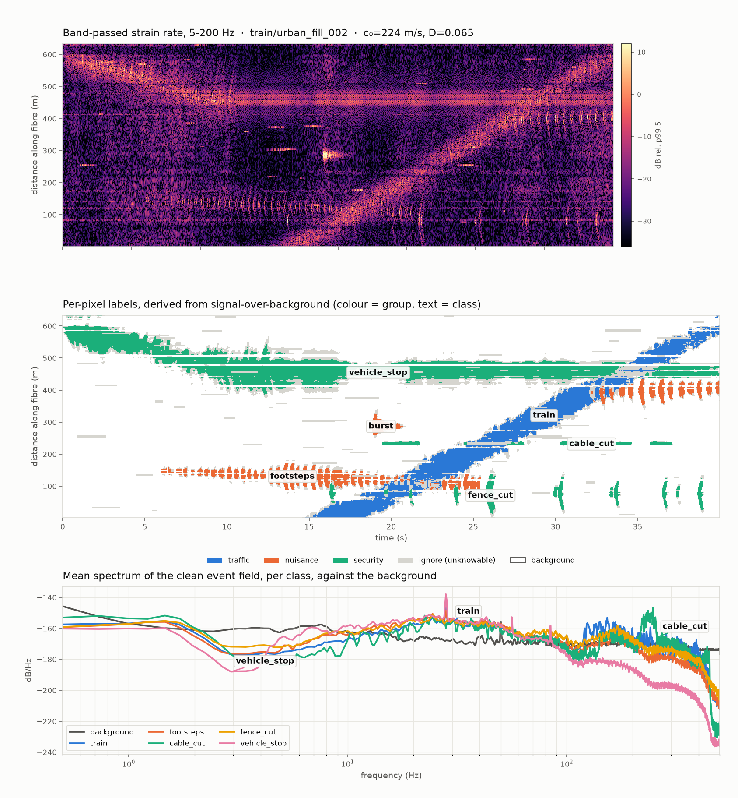

<div align="center">

# 📡 NERW

### **N**iezależny **E**lektroniczny **R**ejestrator **W**ibracji
*(Independent Electronic Vibration Recorder)*

**An optical fibre as a 50-kilometre microphone. Protecting railways without building a new sensor network.**




<sub>A synthetic DAS recording from the generator: signal along the fibre over time, per-pixel labels and mean spectra of each class.</sub>

[Presentation](prezentacja/nerw.html) · [Video](prezentacja/film.mp4) · [Quick start](#-quick-start) · [Architecture](#-architecture)

</div>

---

> 🎯 **Built at the [Baltic Dual Use Hackathon 2026](https://balticdualuse.eu/) in Gdańsk.**
> This is our project from a 48-hour hackathon (11–13 September 2026, University of Gdańsk Library, Oliwa) about technologies with both civilian and defence applications, under the motto *"Shape the Security of Tomorrow"*. It is organised by the CODE:ME Foundation with the University of Gdańsk and Kainos, and covers space, AI, drones & robotics, quantum and microelectronics tracks. NERW is a dual-use AI system: the same fibre-optic sensing protects strategic rail corridors and civilian railways.

## 🚨 The problem

In November 2025 a sabotage attack hit the Polish railway, and the media reported an explosive charge detonated on the tracks. Thousands of kilometres of strategic lines cannot be covered with CCTV: cameras are expensive and leave blind spots.

## 💡 The idea

**Optical fibre already runs along the major railway lines.** DAS (*Distributed Acoustic Sensing*) equipment turns it into a continuous vibration sensor, and an **AI model** recognises what is happening near the track.

| | |
|---|---|
| 🧵 **Existing asset** | cables already in the ground, no construction work |
| 📏 **Range** | up to ~50 km from a single interrogator |
| 🌧️ **Robustness** | rain, wind, road traffic, GPS jamming and radio interference |
| ⚡ **Reaction time** | a fraction of a second |
| 💰 **Cost** | about 10k PLN per km |

The presentation quotes **~93% accuracy** in classifying signatures.

## 🔬 How it works

```
 fibre (−1 m)  ──►  seismic wave in the ground  ──►  strain
                                                        │
   alert  ◄──  per-pixel classification  ◄──  transformer (LeJEPA)  ◄──┘
```

1. **Seismo-acoustic effect.** Ground vibrations stretch the fibre. The interrogator measures this as a change in the phase of the light, channel by channel along the cable.
2. **Stage 1, self-supervised.** A LeJEPA-style transformer (masked reconstruction + SIGReg regularisation) learns what "normal" background looks like. Deviation from the background gives an anomaly score.
3. **Stage 2, classification.** A per-pixel head on the pretrained backbone says *what* is active and *where* on the cable.

### Activity classes

| Group | Classes |
|---|---|
| 🚆 **Traffic** | `train`, `road_vehicle` |
| 🌫️ **Nuisance** | `footsteps`, `burst`, `wheel_flat` |
| 🛡️ **Security** | `digging`, `cable_cut`, `track_tamper`, `fence_cut`, `vehicle_stop` |

> ⚠️ These are **activity** classes. DAS resolves what is being done and where, but not intent or identity. Separating digging from walking is real work. Separating a threat from a passer-by is not something this system can do.

## 🗂️ Architecture

| Path | Role |
|---|---|
| [`simulate_das.py`](simulate_das.py) | Synthetic DAS recording generator (propagation physics, background, labels, HDF5 format) |
| [`make_dataset.py`](make_dataset.py) | Randomised scenarios over site families, builds `data/synthetic/<version>/` |
| [`validate_sim.py`](validate_sim.py) | Checks one generated run: format, `traces = signal + background`, class contrast |
| [`make_showcase.py`](make_showcase.py) | Renders the overview figure shown above |
| [`model/`](model) | Backbone, training, anomaly calibration, inference, evaluation, segmenter (stage 2) |
| [`specfem2d/surface_blast/`](specfem2d/surface_blast) | Standalone SPECFEM2D elastic simulation of an explosive source (50 Hz Ricker) |
| [`prezentacja/`](prezentacja) | Slides (`nerw.html`) and video |
| [`tests/`](tests), [`model/tests/`](model/tests) | Generator, dataset and model tests |

Design decisions that set the generator apart:

- **One propagation operator.** Stationary and moving sources go through the same dispersive, attenuating surface-wave operator, so the synthesis method does not correlate with the class label.
- **Physical attenuation.** Hysteretic soil damping (`α = π·f·D / c(f)`) confines an event to its own stretch of fibre.
- **Labels from SNR, not geometry.** A pixel gets a class when it exceeds the background by a set threshold. Ambiguous pixels get `255` and are ignored in training and scoring.
- **Split by site family, not by seed.** Test families never appear in training.

## 🚀 Quick start

The environment is managed by [uv](https://docs.astral.sh/uv/). torch comes from the PyTorch cu130 index (`pyproject.toml`).

```bash
uv sync
uv run pytest
```

**Dataset**

```bash
uv run python make_dataset.py --out data/synthetic/v4 \
    --train-runs 300 --val-runs 60 --test-runs 120 --max-events 12 --workers 8
uv run python make_showcase.py --data data/synthetic/v4 --out data/showcase
```

**Stage 1: self-supervised training and anomaly detection**

```bash
uv run python -m model.train --data data/synthetic/v4/train --background-only \
    --window-size 1024 --stride 256 --epochs 30 --out runs/das_jepa
uv run python -m model.evaluate --checkpoint runs/das_jepa/checkpoint.pt \
    --anomaly-stats runs/das_jepa/anomaly_stats.pt --input data/synthetic/v4/test --stride 256
```

**Stage 2: activity classification**

```bash
uv run python -m model.finetune --pretrained runs/das_jepa/checkpoint.pt \
    --train data/synthetic/v4/train --val data/synthetic/v4/val --epochs 40 --out runs/segmenter
uv run python -m model.evaluate_classes --segmenter runs/segmenter/segmenter.pt \
    --input data/synthetic/v4/test
```

Data is not stored in the repository (only `manifest.json` and the overview image are). You can rebuild it from the command recorded in the manifest. Details and pitfalls, such as array orientation, are in [`CLAUDE.md`](CLAUDE.md).

## 🗺️ Rollout plan

| Stage | Scope |
|---|---|
| **1. Validation** | Test section: a level crossing in Gdańsk |
| **2. Expansion** | Once the model is confirmed to work |
| **3. 50 km section** | Full deployment: interrogator + AI |

A similar solution operates in Switzerland, and this application would be unique in Europe.

## 🎬 Materials

- 📽️ [Presentation (9 slides)](prezentacja/nerw.html): download and open in a browser. Press `F` for fullscreen.
- 🎥 [Video](prezentacja/film.mp4)

---

<div align="center">
<sub>NERW · research project · all data in the repository is synthetic</sub>
</div>
